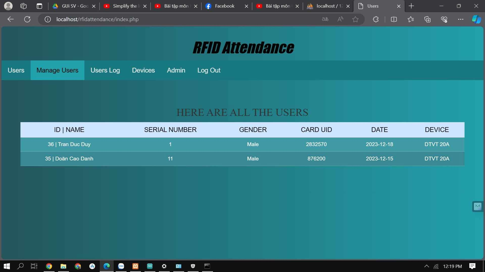
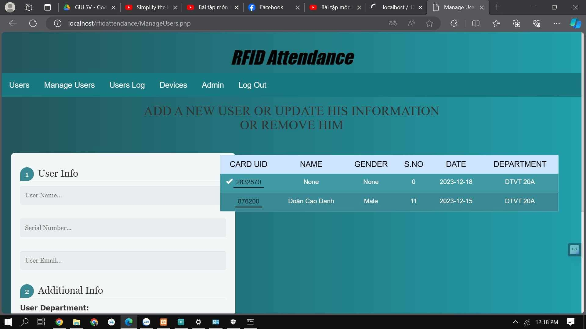
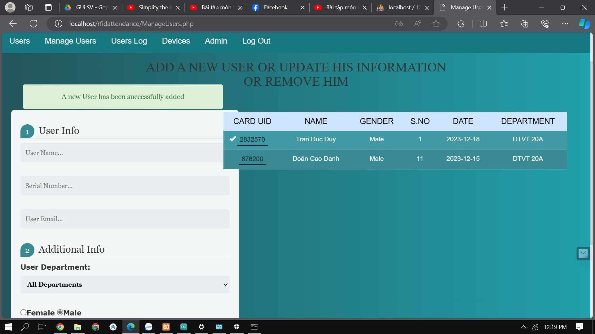
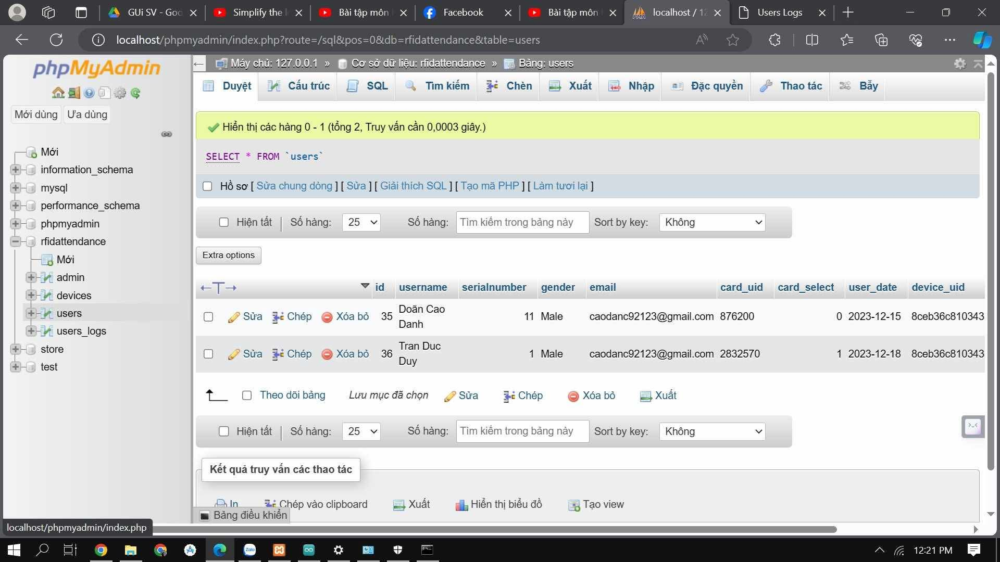

# 📌 ĐIỂM DANH SINH VIÊN DỰA TRÊN RFID SỬ DỤNG ESP8266

## 🧾 Mô tả
Đây là hệ thống điểm danh sinh viên sử dụng thẻ từ RFID và vi điều khiển ESP8266 NodeMCU. Hệ thống cho phép sinh viên điểm danh bằng cách quét thẻ RFID trước đầu đọc RDM6300. Thông tin được xử lý và gửi về cơ sở dữ liệu để lưu trữ và quản lý.

## 🎯 Mục tiêu
- Tự động hóa quá trình điểm danh
- Giảm sai sót và tiết kiệm thời gian
- Quản lý thông tin sinh viên hiệu quả

## 🧠 Công nghệ sử dụng
- **ESP8266 NodeMCU**
- **Module RFID RDM6300 (125kHz)**
- **Thẻ RFID**
- **Buzzer, LED**
- **Arduino IDE**
- **Ngôn ngữ lập trình:** C/C++

## 🛠️ Phần cứng cần có
| Linh kiện        | Số lượng |
|------------------|----------|
| ESP8266 NodeMCU  | 1        |
| RDM6300 RFID     | 1        |
| Thẻ RFID         | 5        |
| Buzzer           | 1        |
| LED              | 2        |
| Điện trở         | 2        |

## ⚙️ Cách hoạt động
1. **Quẹt thẻ:** Khi sinh viên đưa thẻ RFID gần đầu đọc, module RDM6300 sẽ nhận tín hiệu.
2. **Xử lý dữ liệu:** ESP8266 đọc thông tin và so sánh với cơ sở dữ liệu.
3. **Điểm danh:** Nếu hợp lệ, hệ thống xác nhận điểm danh và có thể kích hoạt Buzzer hoặc LED làm tín hiệu phản hồi.

## 📷 Hình ảnh minh họa

